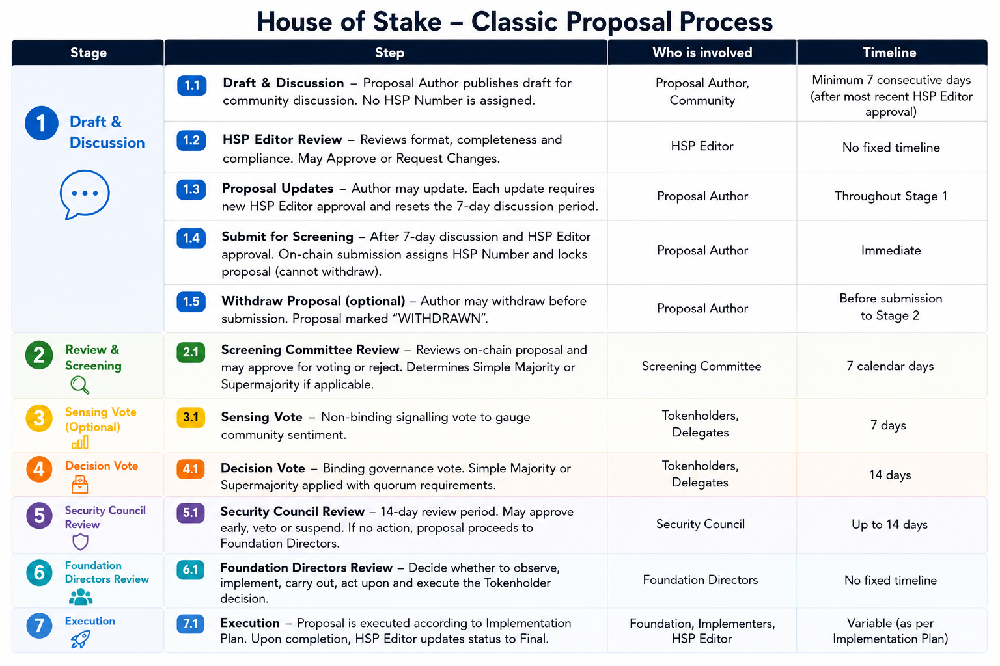
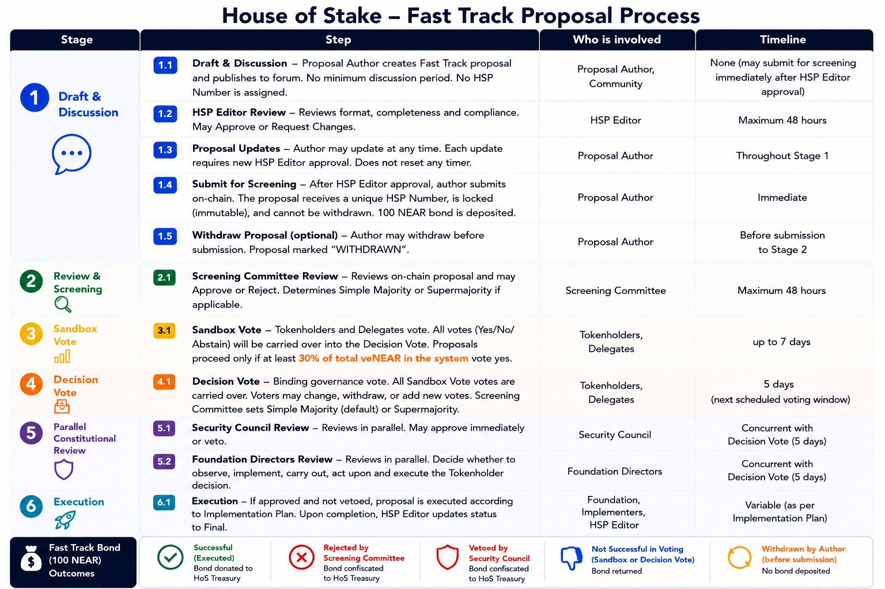

## Overview

Any NEAR tokenholder can submit a proposal, known as a **House of Stake Proposal (HSP)**. The starting point for any proposal is at houseofstake.org , hit “Create Proposal” on the top right and follow the prompts.

There are two types of proposals at House of Stake:

1. **Classic Proposal** — estimated timeline: **36–42 days**
2. **Fast Track Proposal** — estimated timeline: **14–21 days**
Create your proposal at houseofstake.org as a draft. It will be auto-posted to the House of Stake forum.

A **100 NEAR deposit (bond)** is required to create a Fast Track proposal. This bond helps ensure that proposal submitters are accountable and tied to the outcome of their proposal.

---

# 1. Classic Proposal

A **Classic Proposal** follows the standard governance process. It includes a 7-days mandatory community feedback period, review stages, tokenholder voting, and final review before execution.

## Step 1.1–1.5: Draft & Discussion

Create a Classic Proposal at

https://gov.houseofstake.org/proposals

and save it as a draft. Once you are ready to publish it, click "Publish for Discussion".

Your proposal will automatically be posted to the NEAR House of Stake forum, where the community can review it, provide feedback, and engage in early discussion.

After the proposal is published, it enters the discussion stage.

**Minimum review period:**

**7 days**

During this period, the community may review, discuss, and provide feedback on the proposal.

To make changes, edit your current draft at
https://gov.houseofstake.org/proposals

Each update will be automatically reposted to the forum. **Note:** Any changes to your proposal will restart the 7-day feedback period.

---

## Step 1.2: HSP Editor Review

In parallel to the community discussion, the HSP Editor will conduct an initial review to ensure all formal requirements are met before it moves to the next stage.

### Possible Outcomes

| Outcome | Result |
| --- | --- |
| **Approved** | Proposal can move to Screening Committee Review |
| **Request Changes** | Proposal is sent back to the proposal author with notes. |

Once approved by the HSP Editor, the proposal can be submitted for Screening Committee review.

---

## Step 2.1: Screening Committee Review

After HSP Editor approval, the proposal author may submit the proposal to the **Screening Committee Review** stage.

**Review period:**

**7 days**

At this stage, the Screening Committee reviews the proposal before it can proceed to voting. The Screening Committee will also determine whether the proposal requires a **Simple Majority** or **Supermajority** vote. (see House of Stake Constitution and Proposal and Voting Procedures)

### Possible Outcomes

| Outcome | Result |
| --- | --- |
| **Approved** | Proposal opens for voting immediately, snapshot is taken. |
| **Rejected** | The proposal process ends, the proposal is removed from the queue. The Screening Committee provides a rationale. 
---

## Step 4.1: Decision Vote

After the proposal opens for voting, it enters the **Decision Vote** stage.

**Voting period:**

**14 days**

Tokenholders vote on whether the proposal should pass.

**Quorum Requirement**

For a vote to be valid:

**Yes + No + Abstain ≥ 1,000 veNEAR**

## Simple Majority Vote

A proposal passes by Supermajority if:

**Yes / (Yes + No) ≥ 1/2**

## Supermajority Vote

A proposal passes by Supermajority if:

**Yes / (Yes + No) ≥ 2/3**

Abstain votes are excluded from the approval share calculation.

### Possible Outcomes

| Outcome | Result |
| --- | --- |
| **Succeeded** | Proposal passes, and moves to Security Council Review. |
| **Defeated** | Proposal fails, proposal process ends.  |

---

## Step 5.1: Security Council Review

If the proposal succeeds in the Decision Vote, it moves to the Security Council Review stage.

**Review period:**

**Up to 14 days**

The Security Council acts as a **final protection layer after voting** and reviews whether it may negatively affect the NEAR ecosystem (see House of Stake Bylaws).

A veto should be exercised only in cases involving significant governance, ecosystem, legal, financial, technical, or execution concerns.

### Possible Outcomes

| Outcome | Result |
| --- | --- |
| **Approved** | Moves to Foundation Directors Review |
| **Vetoed** | Proposal fails, and proposal process ends. |

---

## Step 6.1: Foundation Directors Review

If approved by the Security Council, the proposal moves to the Foundation Directors Review stage.

**Review period:**

**No fixed timeline**

The **House of Stake Foundation Directors** review the proposal before final approval and may decline to implement it if it is unlawful, breaches obligations, or compromises integrity or interests (see House of Stake Constitution).

### Possible Outcomes

| Outcome | Result |
| --- | --- |
| **Approved** | Moves to Execution |
| **Declined** | Proposal fails, and proposal process ends. |

---

## Step 7.1: Execution

If the proposal passes all required stages, it will proceed to one of the following outcomes:

## Final Proposal

The proposal moves to:

**Execution or implementation of approved changes**

## Policy Proposal

If the proposal relates to governance rules, constitutional documents, or policy changes, it may become part of:

**Constitutional Documents / Governance Policies**

---

# 2. Fast Track Proposal

The **Fast Track Proposal** process offers a shorter approval and voting timeline, using an accelerated review and voting process compared to a Classic Proposal.

## Step 1.1–1.5: Draft & Discussion

Any NEAR tokenholder can submit a **Fast Track House of Stake Proposal (HSP)**. The starting point for any proposal is at gov.houseofstake.org. Click **“Create Proposal”** on the top right and follow the prompts.

By clicking "Publish for Discussion", the proposal will be automatically posted on the House of Stake forum for review. This stage has no minimum duration.

Any changes made during this stage are automatically reflected in the forum post.

If needed, the proposal may be edited, or withdrawn.

## Step 1.2: HSP Editor Review

The HSP Editor will conduct an initial review to ensure all formal requirements are met before it moves to the next stage. 

**Maximum review period:**

**48 hours**

The HSP Editor reviews the proposal to ensure that it is clear, complete, properly formatted, and suitable for Fast Track consideration.

### Possible Outcomes

| Outcome | Result |
| --- | --- |
| **Approved** | Proposal is tagged with an HSP number and moves to Screening Committee Review |
| **Request Changes** | Proposal is sent back for redraft |

Once approved by the HSP Editor, the proposal is ready to be submitted for screening (step 1.4)
A **100 NEAR bond deposit** is required to submit. This bond helps ensure that proposal submitters remain accountable for the quality, seriousness, and outcome of their proposal.

---

## Step 2.1: Screening Committee Review

The proposal enters the **Screening Committee Review** stage. At this stage, the Screening Committee reviews the proposal before it can proceed to voting. The Screening Committee will also determine whether the proposal requires a **Simple Majority** or **Supermajority** vote.

**Maximum review period:**

**48 hours**

### Possible Outcomes

| Outcome | Result |
| --- | --- |
| **Approved** | Moves to Sandbox Vote |
| **Rejected** | Bond slashed |

**Note:** Any slashed bond will be sent to the **House of Stake Treasury**.

---

## Step 3.1: Sandbox Vote
After Screening Committee approval, the proposal enters the **Sandbox Vote** stage.

**Voting period:**

**7 days**

To pass this stage:

**At least 30% of veNEAR supply in the system must vote in favor**

If the Sandbox Vote passes, the favor votes are carried over to the Decision Vote.

### Possible Outcomes

| Outcome | Result |
| --- | --- |
| **veNEAR threshold reached** | Moves to Decision Vote |
| **veNEAR threshold not reached** | Proposal ends, bond returned |

---

## Step 4.1: Decision Vote

If approved, the proposal opens for voting on the following:

**Monday, 3 PM UTC**

The proposal then enters the **Decision Vote** stage, which runs concurrently with the Parallel Constitutional Review.

**Maximum voting period:**

**5 days**

Tokenholders and Delegates vote on whether the proposal should pass. All Sandbox Vote votes are carried over, and voters may change, withdraw, or add new votes.

### Possible Outcomes

| Outcome | Result |
| --- | --- |
| **Approved** | Moves to Execution |
| **Defeated** | Bond returned |
---

## Step 5.1: Security Council Review

Running concurrently with the Decision Vote, the **Security Council** reviews the proposal.

The Security Council acts as a **final protection layer after voting** and reviews whether it may negatively affect the NEAR ecosystem (see House of Stake Bylaws).

A veto should be exercised only in cases involving significant governance, ecosystem, legal, financial, technical, or execution concerns.

### Possible Outcomes

| Outcome | Result |
| --- | --- |
| **Approved/No action** | Moves to Execution |
| **Vetoed** | Bond slashed |
---

## Step 5.2: Foundation Directors Review

Running concurrently with the Decision Vote, the **House of Stake Foundation Directors** review the proposal and may decline to implement it if it is unlawful, breaches obligations, or compromises integrity or interests (see House of Stake Constitution).

### Possible Outcomes

| Outcome | Result |
| --- | --- |
| **Approved** | Moves to Execution |
| **Vetoed** | Bond slashed |

**Note:** Any slashed bond will be sent to the **House of Stake Treasury**.

---

## Step 6.1: Execution

If the Fast Track Proposal passes the required voting and review stages, the bond is sent to the **HOS Treasury**, and the proposal proceeds to:

**Execution**

---

# Proposal Queue
Up to **3 proposals** may run concurrently during the review and voting stages.

If a proposal is not approved at any stage, it is removed from the queue. This allows the next eligible proposal to enter the process.
