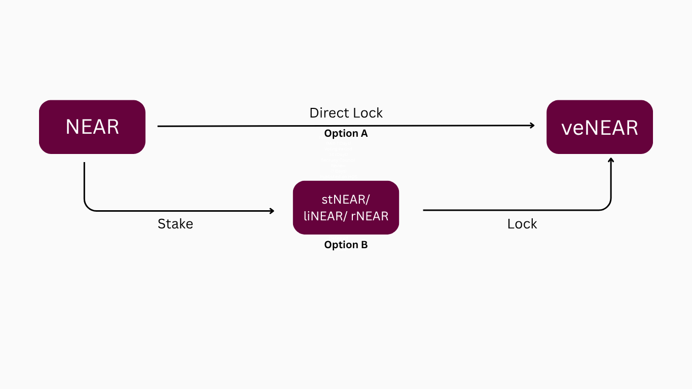

**veNEAR (vote-escrowed NEAR)** is the governance power used in House of Stake.

In plain language: you lock eligible assets, and in return you receive voting power that can be used directly or delegated.

By locking NEAR, stNEAR,liNEAR or rNEAR tokens, users receive veNEAR. The longer the lock duration, the greater the voting power received. This aligns incentives for long-term commitment and active participation.

## Key Characteristics

- **Non-transferable**: veNEAR cannot be transferred or traded.
- **Time-weighted voting power**: Voting power increases with the duration of the lock — no minimum or maximum period required.
- **Multi-asset support**: Users can lock NEAR, stNEAR, or liNEAR to receive veNEAR.

## Purpose of veNEAR

- Aligning stakeholders over the long-term to influence the direction of NEAR governance.
- Provide a clear and predictable incentive structure via reward distribution.
- Encourage thoughtful participation and discourage manipulation.

## Why It Matters

veNEAR creates strong alignment between governance power and economic commitment. Those who lock assets for longer periods gain more influence, encouraging responsible, engaged decision-making that supports the long-term health of the NEAR ecosystem.
